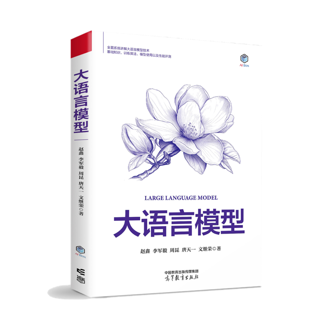

# 大语言模型
作者：[赵鑫](<http://aibox.ruc.edu.cn/>)，[李军毅](<https://lijunyi.tech/>)，[周昆](<https://lancelot39.github.io/>)，[唐天一](<https://steventang1998.github.io/>)，[文继荣](<https://gsai.ruc.edu.cn/jrwen>)  

## 关于本书

为了更好地普及和传播大模型技术的最新进展与技术体系，我们于2023年3月发表了大语言模型英文综述文章《A Survey of Large Language Models》，并不断进行更新完善，目前已经更新至第14个版本，95页正文1064个参考文献。自英文综述文章上线后，陆续有读者询问该英文综述文章是否有对应的中文版本。为此，我们于2023年8月发布了该综述（v10）的中文翻译版。2023年12月底，为了更好地提供大模型技术的中文参考资料，我们启动了中文书的编写工作，并且于2024年4月完成初稿，经过历时5个月的后续修正与完善，这本书终于出版了。

与英文综述文章的定位不同，本书更关注为大模型初学者提供整体的技术讲解，为此我们在内容上进行了大范围的更新与重组，力图展现一个系统的大模型技术框架和路线图。本书适用于具有深度学习基础的读者阅读，可以作为一本基础的大模型参考书籍。在准备中文书的过程中，我们广泛阅读了现有的经典论文、相关代码和学术教材，从中提炼出核心概念、算法与模型，并进行了系统性的组织与讲解。我们对于每个章节的内容初稿都进行了多次修正，力求表达的清晰性与准确性。然而在图书编写过程中，我们深感自身能力与知识的局限性，尽管已经付出了巨大的努力，但仍难免会有遗漏或不足之处。本书的出版仅是一个起点，我们将编写此书的过程也作为一个自身的学习过程，希望能够通过本书与读者进行深入交流，向更多的行业同行学习，欢迎大家为这本书提出宝贵的指导建议。


<br>
<div align="center">
  <a href="https://item.jd.com/14901508.html" target="_blank">
    
  </a>
</div>
<br>


## 推荐语
<link rel="stylesheet" href="./assets/css/styles.css">

<div class="recommendation">
  <p>本书的编者长期从事大模型技术的相关研究，曾组织研发了文澜、玉兰等一系列大模型，具有深厚的科研与实践积累。本书内容深入结合了编者在研发大模型过程中的第一手经验，全面覆盖了大模型技术的多方面知识，可以作为深入学习大模型技术的参考书籍，强烈推荐阅读!</p>
  <p class="author">张宏江 北京智源人工智能研究院学术顾问委员会主任、美国国家工程院外籍院士</p>
</div>

<div class="recommendation">
  <p>本书的编写团队于2023年3月发布了学术界首篇大语言模型综述文章“A Survey of Large Language Models”，受到了广泛关注。在这篇经典综述文章基础上，编写团队对编写内容进行了精心组织与撰写，并且融入了其长期从事大模型技术的科研经验。本书具有重要的参考与学习价值，是一部值得推荐的大模型佳作。</p>
  <p class="author">鄂维南 北京大学讲席教授、中国科学院院士</p>
</div>

<div class="recommendation">
  <p>大模型作为一种快速兴起的人工智能技术，已经深刻地影响了未来的科技发展趋势。为了更好地推进大模型技术在我国的学习与普及，亟须有专业的中文技术图书进行系统介绍。本书是一部精心编写的大模型技术图书，涵盖了预训练、微调、对齐、提示工程等众多基础内容，能够为相关从业人员提供权威的、系统的学习参考，强烈推荐阅读。</p>
  <p class="author">张亚勤 清华大学智能科学讲席教授、中国工程院外籍院士</p>
</div>

## 课程资源
为了帮助课程教学及传播大模型知识，《大语言模型》编写团队特别提供了相应的PDF课件：


| 课程 | 目录 |
|:----:|:----:|
| 第一课 初识大模型（对应本书第一、二章） | 语言模型发展历程、大模型技术基础、GPT和DeepSeek模型介绍 |
| 第二课 模型架构（对应本书第五章） | Transformer模型介绍、模型详细配置、长上下文模型和新型架构 |
| 第三课 预训练（对应本书第四、六章） | 预训练之数据工程、预训练之具体流程、训练优化、模型参数量与训练效率估计 |
| 第四课 指令微调（对应本书第七章） | 指令微调与常见策略、轻量化微调 |
| 第五课 人类对齐（对应本书第八章） | 人类对齐之基础、人类对齐之进阶 |
| 第六课 解码与部署（对应本书第九章） | 大模型解码、解码效率分析与加速算法、模型压缩 |
| 第七课 提示学习（对应本书第十章） | 提示设计、上下文学习、思维链提示、检索增强生成 |
| 第八课 复杂推理（对应本书第十一章） | 规划与智能体、复杂推理与慢思考 |


如果需要相应的原始PPT课件，请邮件联系 batmanfly at qq.com：

邮件标题：《大语言模型》PPT课件-{姓名}-{机构}

邮件内容请说明PPT课件用途，如用在具体教学课程请列出课程名称。

未经许可，不得二次传播。

## 引用格式  

```
@book{LLMBook,
  title = {大语言模型},
  publisher = {高等教育出版社},
  year = {2024},
  author = {赵鑫, 李军毅, 周昆, 唐天一, 文继荣},
  address = {北京},
  url = {https://llmbook-zh.github.io/},
}

```

## 内容贡献

本书各章节的主要负责人和参与人名单如下：

- 第三章的负责人是闵映乾和杨晨，参与人有李军毅、周昆； 
- 第四章的负责人是张君杰、侯宇蓬和周昆； 
- 第五章的负责人是董梓灿，参与人有田震和唐天一；
- 第六章的负责人是唐天一和陈昱硕；
- 第七章的负责人是唐天一，参与人有成晓雪；
- 第八章的负责人是李军毅和陈志朋；
- 第九章的负责人是陈昱硕、刘沛羽和唐天一，参与人有周昆；
- 第十章的负责人是李军毅、汤昕宇和都一凡，参与人有王晓磊；
- 第十一章的负责人是任瑞阳和蒋锦昊，参与人有李军毅；
- 第十二章的负责人是张北辰和周昆，参与人有张高玮；
- 第十三章的负责人是周昆，参与人（按拼音字母排序）有蒋锦昊、李依凡、刘子康、孙文奇、王禹淏、徐澜玲、杨锦霞和郑博文。

同时感谢其他参与本书编写、校对的同学，他们（按拼音字母排序）是：曹乾、曹展硕、陈杰、程伽雅琪、戴孙浩、邓欣、丁毅杰、冯雪扬、高泽峰、苟志斌、辜子惠、郭歌扬、何东楠、侯新铭、胡译文、李炳黔、李成远、李欣潼、刘恩泽、刘炯楠、刘子涵、罗文扬、梅朗、欧柯杉、彭涵、阮恺、苏炜航、孙一丁、汤奕如、王家鹏、王磊、王淑婷、姚峰、尹彦彬、詹玉梁、张景森、张良、朱天宇和朱余韬。

本书在编写过程得到了中国人民大学大型科学仪器共享平台的算力资源支持，在此对于陈跃国、鲁蔚征、石源三位老师表示衷心的感谢。

## 反馈意见
在准备中文书的过程中，我们广泛阅读了现有的经典论文、相关代码和教材，从中提炼出核心概念、主流算法与模型，并进行了系统性的组织与介绍。 我们对于每个章节的内容初稿都进行了多次修正，力求表达的清晰性与准确性。 然而，在书写过程中，我们深感自身能力与知识的局限性，尽管已经付出了极大的努力，但难免会有遗漏或不当之处。本书的初版仅是一个起点，我们计划在网上持续进行内容的更新和完善，并特别欢迎读者提出宝贵的批评与建议，也会同步在网站上对于提出宝贵建议的读者进行致谢。我们将编写此书的过程当做一个自身的学习过程，也希望能够通过本书与读者进行深入交流，向更多的行业同行学习

如果您有任何意见、评论以及建议（先确认最新版本中是否已经修正），请通过GitHub的[Issues](https://github.com/LLMBook-zh/LLMBook-zh.github.io/issues)页面进行反馈，或通过邮件发送至作者邮箱***batmanfly at qq.com***，***lijunyi at ruc.edu.cn***，***francis_kun_zhou at ruc.edu.cn***，***steventianyitang at outlook.com***。

为了方便阅读，这里提供之前的中文书电子版本： [下载链接1](https://llmbook-zh.github.io/LLMBook.pdf)，[下载链接2](http://aibox.ruc.edu.cn/zws/index.htm)，但由于后续修订和篇幅原因，大模型应用章节未纳入正式出版，一切内容以正式出版物为准。
